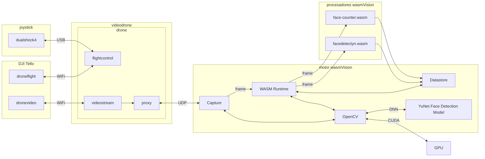
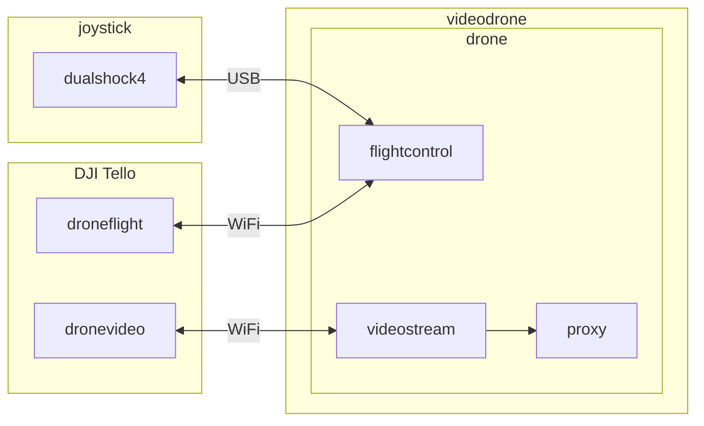
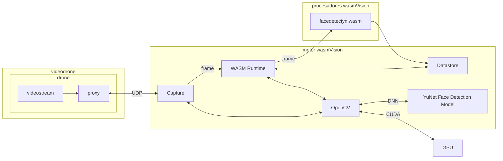
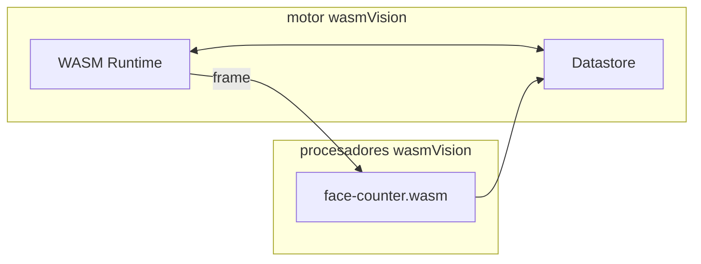

```mermaid
flowchart LR
subgraph videodrone
    subgraph drone
        flightcontrol
        videostream-->proxy
    end
end
subgraph motor wasmVision
    proxy<--UDP-->Capture
    Runtime[WASM Runtime]
    Capture--frame-->Runtime
    Capture<-->OpenCV
    Runtime<-->OpenCV
    Runtime<-->Datastore
    OpenCV<--DNN-->YuNet[YuNet Face Detection Model]
end
OpenCV<--CUDA-->GPU
subgraph procesadores wasmVision
    Runtime--frame-->facedetectyn.wasm
    Runtime--frame-->face-counter.wasm
    facedetectyn.wasm-->Datastore
    face-counter.wasm-->Datastore
end
subgraph DJI Tello
    droneflight<-- WiFi -->flightcontrol
    dronevideo<-- WiFi -->videostream
end
subgraph joystick
    dualshock4<-- USB -->flightcontrol
end
```

```mermaid
flowchart LR
subgraph videodrone
    subgraph drone
        flightcontrol
        videostream-->proxy
    end
end
subgraph DJI Tello
    droneflight<-- WiFi -->flightcontrol
    dronevideo<-- WiFi -->videostream
end
subgraph joystick
    dualshock4<-- USB -->flightcontrol
end
```

```mermaid
flowchart LR
subgraph videodrone
    subgraph drone
        videostream-->proxy
    end
end
subgraph motor wasmVision
    proxy<--UDP-->Capture
    Runtime[WASM Runtime]
    Capture--frame-->Runtime
    Capture<-->OpenCV
    Runtime<-->OpenCV
    Runtime<-->Datastore
    OpenCV<--DNN-->YuNet[YuNet Face Detection Model]
end
OpenCV<--CUDA-->GPU
subgraph procesadores wasmVision
    Runtime--frame-->facedetectyn.wasm
    facedetectyn.wasm-->Datastore
end
```

```mermaid
flowchart LR
subgraph motor wasmVision
    Runtime[WASM Runtime]
    Runtime<-->Datastore
end
subgraph procesadores wasmVision
    Runtime--frame-->face-counter.wasm
    face-counter.wasm-->Datastore
end
```
