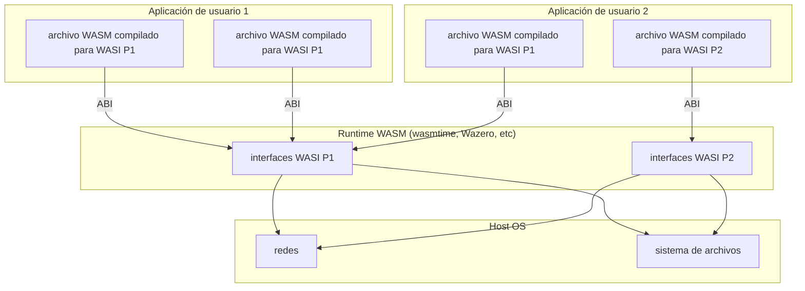

```mermaid
flowchart
    subgraph "Aplicación de usuario 1"
        WASMP1A[archivo WASM compilado para WASI P1]
        WASMP1B[archivo WASM compilado para WASI P1]
    end
    subgraph "Aplicación de usuario 2"
        WASMP2A[archivo WASM compilado para WASI P1]
        WASMP2B[archivo WASM compilado para WASI P2]
    end
    subgraph "Runtime WASM (wasmtime, Wazero, etc)"
        P1[interfaces WASI P1]
        P2[interfaces WASI P2]
    end
    WASMP1A--ABI-->P1
    WASMP1B--ABI-->P1
    WASMP2A--ABI-->P1
    WASMP2B--ABI-->P2
    subgraph "Host OS"
        red[redes]
        archivos[sistema de archivos]
    end
    P1-->archivos
    P1-->red
    P2-->archivos
    P2-->red
```
