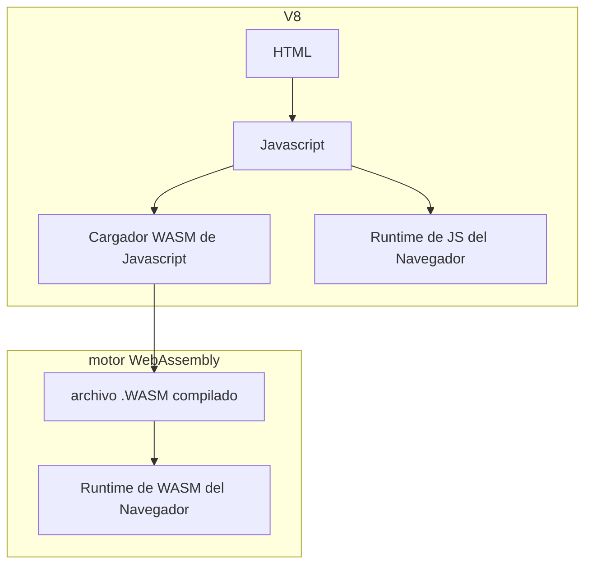

```mermaid
flowchart
    subgraph "V8"
    HTML-->Javascript;
    Javascript-->JSShim[Cargador WASM de Javascript];
    Javascript-->JSRuntime[Runtime de JS del Navegador];
    end
    subgraph "motor WebAssembly"
    WASM[archivo .WASM compilado]-->WASMRuntime[Runtime de WASM del Navegador];
    end
    JSShim-->WASM
```
